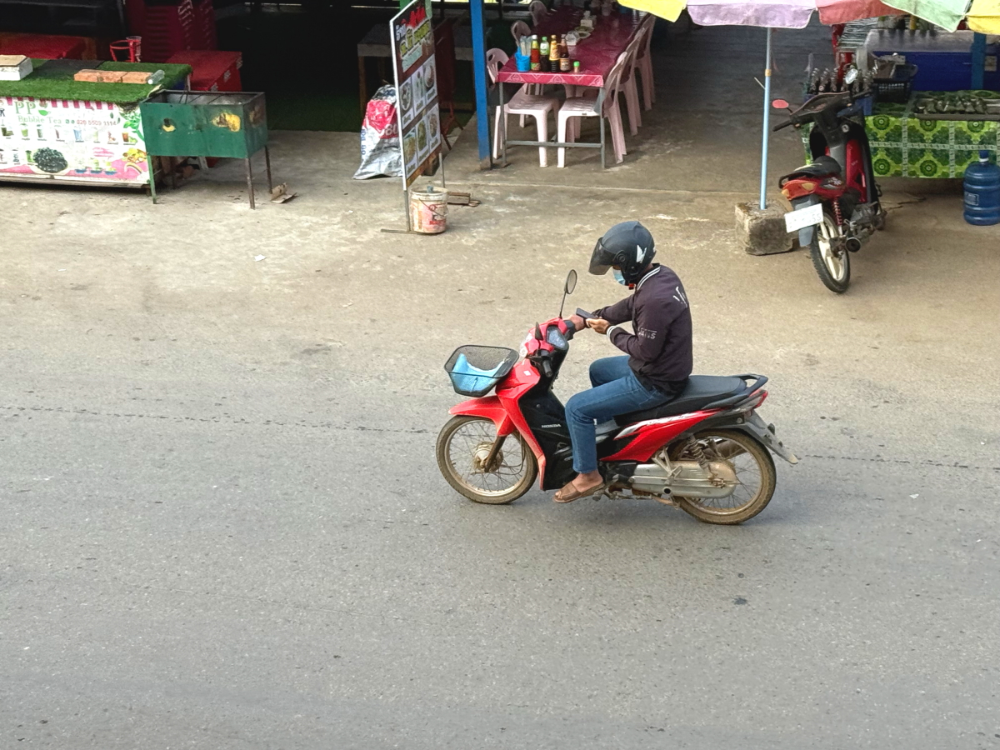
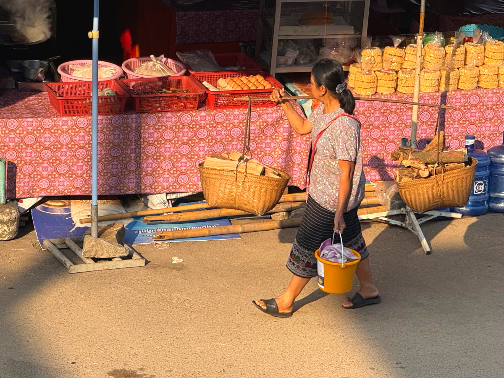
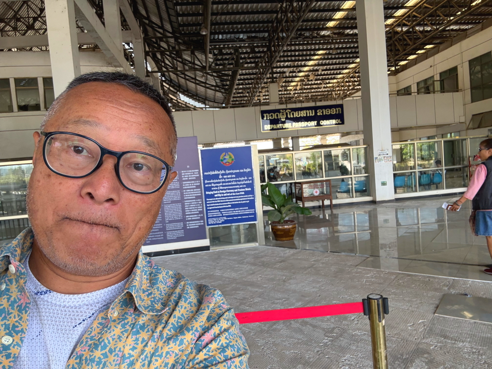

# 20250213_chiangrai

<html>
<head>

<meta charset="UTF-8">
<meta http-equiv="Content-Type" content="text/html; charset=UTF-8">
<meta http-equiv="X-UA-Compatible" content="IE=EmulateIE10" />
<meta http-equiv="X-UA-Compatible" content="IE=edge">

<!--ここから上はお決まりの定型文です-->

<!--ここからが表現の書式などを決めるcssという部分-->

<link href="https://cdnjs.cloudflare.com/ajax/libs/lightbox2/2.7.1/css/lightbox.css" rel="stylesheet">

</head>

<body>

モバイル端末をお使いの場合は、画面を横向きにすると
より見やすくご覧頂けます。

<!--ここ上は、ほぼそのまま使います！-->

<!--QRコードの挿入例-->

 アクセス用QRコード

<marquee direction="left" scrollamount="20" width="30%">(^_^)/~alis</marquee>

<!--流れ文字の挿入例-->
<h1><marquee behavior="left">!!! 2025/02/13、ラオスに２泊してタイに戻ると、VISAが２ヶ月と10日延長されました!!!</marquee></h1>

                          

<!--ここから下が、本体部分-->

<h2>月がメコン川挟んだタイ側の西の空に沈みます 朝6:28</h2>

    
<h2>屋台に食材を運び込むお姉さん</h2>

    
<h2>ここまでに画像は全て宿泊した宿のベランダからの撮影でした</h2>

    
<h2>宿からラオスの出国ゲートに向かいます</h2>

    
<h2>またまた宿のお婆さんの親戚に送ってもらいました</h2>

    
<h2>出国手続きの建物入り口で記念撮影</h2>

    
<h2>ここを通過すればラオスは出国</h2>

    
<h2>逆にラオスに入国する白人さん達の集団</h2>

    
<h2>出国ゲートでたら綺麗なお花が咲いていました</h2>

    
<h2>出国ゲートでラオスを出たところ、緑のバスでメコン川の橋を渡ります</h2>

    
<h2>バスは満員でした</h2>

    
<h2>橋の前半部はラオスの国旗</h2>

    
<h2>橋の後半部、タイ側はタイの国旗になります</h2>

    
<h2>タイの出入国ゲートの建物</h2>

    
<h2>3日振りにタイに再入国して、VISAは2ヶ月と10日ほど延長されました</h2>

    
<h2>両替窓口、スマホ向けたら窓口のお姉さんが笑顔作ってくれました</h2>

    
<h2>タイ側のエントランス、天井に野鳥が住み着いてて、鳥の鳴き声が響き渡ってました</h2>

    
<h2>お昼は途中の街の食堂で軽く取ります</h2>

    
<h2>おばあちゃんは引退しても子供達が心配で営業状態を視察</h2>

    
<h2>偶然ですが、対岸真正面にはラオスで宿泊した宿</h2>

    
<h2>食堂からこの道を入ったところで見えました</h2>

<h2>GPSで確認すると確かに宿の真正面でした</h2>

    
<h2>ラオス側からよく見えた仏像様も真下から見えました</h2>

    
<h2>しばらくメコン川沿いを北上</h2>

    
<h2>道路が川面まで下がったので水辺で撮影</h2>

    
<h2>北の方に見えるビル群はラオス側のカジノ街</h2>

    
<h2>帰り道にある都市、チエンセーンで市場に寄ります 画像のクリックでGoogleMapsに飛びます ↓</h2>

    
<h2>街道沿いには昔の寺院跡</h2>

    
<h2>3日振りに見るメーチャンの夕暮れ</h2>

    
<h2>ショッピングモールの駐車場から東の空に登るお月様 月齢14.7</h2>

    
<h2>最後は、ほぼ南中したカノープスが木の上で輝く映像</h2>

    

  
<h2>今日のBGMは New Country Music 2025 🌕 Luke Combs, Morgan Wallen, Kane Brown, Chris Stapleton, Brett Young,</h2>
<iframe width="560" height="315" src="https://www.youtube.com/embed/BYMqvahuFUQ?si=aHV8mMt-PKClrxuv" title="YouTube video player" frameborder="0" allow="accelerometer; autoplay; clipboard-write; encrypted-media; gyroscope; picture-in-picture; web-share" referrerpolicy="strict-origin-when-cross-origin" allowfullscreen></iframe> 

   
<h2>以上、ラオスに２泊してタイに戻りVASAが無事約２ヶ月延長 ここまでご覧いただきありがとうございました。</h2>

     
<h2>
<a href="https://torokoid.github.io/20241126_chiangrai/" target="_blank">Back to the menu page</a>
</h2>

   

         

  

      

<!--本体はここまで-->

<!--画面に空白地帯を作って、背景が見えるようにしています-->
                                              

<!-- フッタ -->
<footer>

Copyright 2025/02/14 alis @ChiangRai

</footer>

<!--HPにさまざまなJavaScriptを呼び込むための書式-->

